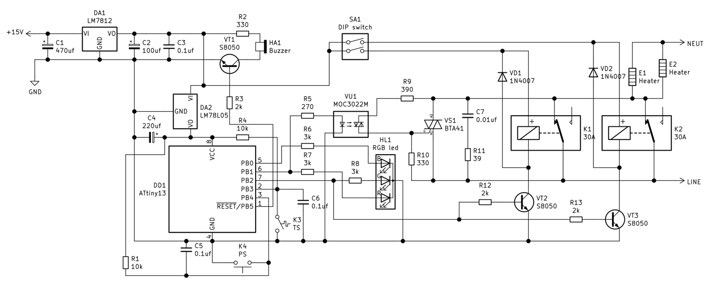
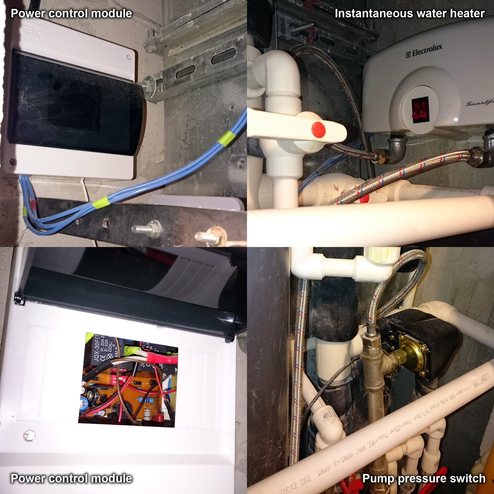

# heater-autoswitch
This is the simple automatic power switch for instantaneous water heaters based on pump pressure switch and power control module. Pump pressure switch allows adjustment of the cut-on and cut-off pressure independently, so it can turn the heater on or off (through power control module) when the water tap is turned on or off. Power control module works like a high current «knife switch» triggered by the pump pressure switch. It connected to the dedicated 25A power line via GFCI.

**CAUTION!**\
**There are dangers in dealing with high voltage equipment and household plumbing systems. If you make an attempt to build this project, you do so at your own risk. I'm not liable for any injury, damage, loss, accident or other irregularity which may be caused by or resulting from any defect, malfunction of any electric, plumbing or other equipment.**

I’ve used a standard electrical junction box (IP54) as an enclosure for a power control module  circuit board. SA1 is accessible via front window (see overview.jpg), so if the K1 or K2 coil gets damaged (which could cause malfunction in the relay) it can be switched off without desoldering.

As a power switch (K1 and K2) I use 2 cheap relays JQX-30F (T91) with a high current switching capability. To protect relay contacts from transient voltage spikes and dramatically
increase their lifetime I use power triac BTA41 as a primary switch. So when the water pressure in a pipeline falls down (someone turns on water tap in kitchen or bathroom) pressure switch sets 0 on PB4, the microcontroller switches triac on for first, then switches relays on. When the water pressure goes high (tap turned off) the pressure switch sets 1 on PB4, microcontroller switches relays off and finally switches triac off.
PB3 with a thermal switch (KSD301, 50°C, NO) works as a triac overheat protection system. It’s mounted alongside the triac on the same heatsink (100mm²). C7R11 can be omitted if a short wire is used to connect the heater and power relays.

As a water heater I use Electrolux Smartfix 3.5 (16A, 3.5 kW), but any other with the same current consumption (max. ~20A) is quite appropriate. All high current connections, including relay and triac terminals A1 (MT1), A2 (MT2) connections are made with thick wire (approx. 2.5mm dia). Cheapest AC-DC led driver (SMPS) I’ve used as a power supply for the control module.

Microcontroller firmware flashed using an HVSP programmer to turn on the RSTDISBL fuse. The CPU is clocked from an internal oscillator which runs at 128 kHz. RGB led (common cathode) shows the operating mode of the power module. In standby mode (when the water tap is turned off) blue led flashes once per 15 seconds. When someone is turning the water tap, MC switches the triac on and the red led goes high in parallel with a buzzer (which has an internal 1kHz oscillator). After 100-150 ms MC switches power relays and green led on and simultaneously switches triac, red led and buzzer off. Green led indicates a normal operating mode.
